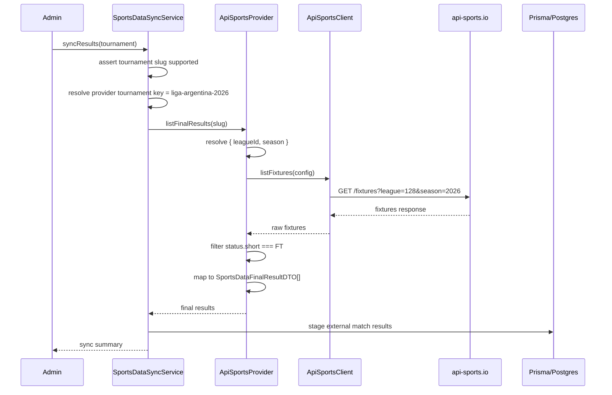

# Technical Design: Liga Argentina api-sports provider

## Summary

Add a new `api-sports` implementation of the existing `SportsDataProvider` contract in `apps/api/src/sports-data`, wire it into provider selection, and allow provider-backed sync for `liga-argentina-2026`.

The design keeps the current architecture intact:

- one configured provider per deployment;
- existing DTOs and sync flows unchanged;
- no Prisma/schema changes;
- no frontend or scheduler work in this slice.

## Goals

- Support `SPORTS_DATA_PROVIDER=api-sports`.
- Resolve `liga-argentina-2026` through api-sports tournament config.
- Map api-sports teams, venues, fixtures, and FT-only final results into shared DTOs.
- Preserve existing `football-data` and `mock` behavior.

## Non-goals

- No multi-provider runtime in one deployment.
- No background scheduling/caching/rate-limit control.
- No database migration.
- No frontend branding changes.

## Current architecture

`SportsDataSyncService` already depends on a single injected `SportsDataProvider`:

- `listTeams()` → team import/upsert
- `listVenues()` → venue import/upsert
- `listFixtures()` → fixture import/upsert
- `listFinalResults()` → result staging for admin confirmation

Today, `SportsDataModule` selects either:

- `FootballDataProvider` for `SPORTS_DATA_PROVIDER=football-data`
- `MockSportsDataProvider` otherwise

This change adds a third provider without changing the sync service contract.

## Proposed architecture

### 1. New api-sports provider stack

Add a provider stack parallel to the football-data implementation:

- `api-sports.types.ts` — raw response/config/client types
- `api-sports.config.ts` — tournament slug → `{ leagueId, season, displayName }`
- `api-sports.client.ts` — HTTP wrapper for api-sports endpoints
- `api-sports.provider.ts` — DTO mapping + FT filtering

### 2. Provider selection

Extend `SPORTS_DATA_PROVIDER_KEYS` with `API_SPORTS: 'api-sports'` and update `SportsDataModule` so:

- `api-sports` instantiates `ApiSportsProvider`
- `football-data` keeps current behavior
- unknown/empty values still fall back to mock

### 3. Tournament gating and provider key resolution

`SportsDataSyncService` must allow `liga-argentina-2026` in `SUPPORTED_PROVIDER_TOURNAMENT_SLUGS`.

It also must resolve the provider tournament key by provider type:

- `football-data` → slug
- `api-sports` → slug
- `mock` / fallback providers → current behavior

This is required because both real providers use config maps keyed by tournament slug, while the current code only special-cases `football-data`.

### 4. Data source strategy

Use api-sports endpoints as follows:

- `listTeams()` → `/teams?league={leagueId}&season={season}`
- `listFixtures()` → `/fixtures?league={leagueId}&season={season}`
- `listVenues()` → derive from `/fixtures...` venue payloads and dedupe by venue id
- `listFinalResults()` → derive from `/fixtures...`, include only `fixture.status.short === 'FT'`

This keeps venue and final-result logic aligned with the same fixture feed used by sync.

## Sequence



## Provider mapping

### Tournament config

`apps/api/src/sports-data/api-sports.config.ts`

```ts
export const API_SPORTS_TOURNAMENT_CONFIGS = {
  "liga-argentina-2026": {
    leagueId: 128,
    season: 2026,
    displayName: "Liga Profesional Argentina 2026",
  },
} as const;
```

The provider will throw if an unconfigured slug is requested, matching the football-data pattern.

### Raw response model

`api-sports.types.ts` should model only the fields used by the provider, not the full API surface.

Expected response envelope:

- top-level `response: T[]`
- `fixture.id`, `fixture.date`, `fixture.status.short`, `fixture.venue.{id,name,city}`
- `league.round`
- `teams.home.id`, `teams.home.name`, `teams.home.code`
- `teams.away.id`, `teams.away.name`, `teams.away.code`
- `goals.home`, `goals.away`
- teams endpoint `team.{id,name,code,country}`

### Team mapping

From `/teams` payload:

- `externalId` ← `String(team.id)`
- `name` ← `team.name`
- `shortName` ← fallback chain:
  1. non-empty `team.code`
  2. acronym from team name
  3. sanitized first 3-4 chars of name
- `countryCode` ← `null` unless provider exposes a reliable code value
- `flagCode` ← same reliable-code rule; otherwise `null`
- `primaryColor` / `secondaryColor` ← `null`

Rationale: api-sports club payloads do not guarantee ISO country or branding colors.

### Venue mapping

From `/fixtures` payload:

- `externalId` ← `String(fixture.venue.id)`
- `name` ← `fixture.venue.name`
- `city` ← `fixture.venue.city ?? null`
- `countryCode` ← `null` (not reliably present in fixture venue payload)
- `capacity` ← `null` unless a reliable capacity field is available in the chosen endpoint

Provider behavior:

- skip venues with missing/invalid provider venue id or name
- dedupe by `externalId`

### Fixture mapping

From `/fixtures` payload:

- `externalId` ← `String(fixture.id)`
- `homeTeamExternalId` ← `String(teams.home.id)`
- `awayTeamExternalId` ← `String(teams.away.id)`
- `venueExternalId` ← `String(fixture.venue.id)` when present, else `null`
- `kickoffAt` ← parsed `fixture.date`
- `stage` ← normalized from `league.round`
- `groupName` ← `null` unless a future Liga feed exposes group semantics

Provider should skip fixtures missing either team id, matching the current football-data safety pattern.

### Final result mapping

From `/fixtures` payload where `fixture.status.short === 'FT'`:

- `externalMatchId` ← `String(fixture.id)`
- `homeScore` ← `goals.home`
- `awayScore` ← `goals.away`
- `playedAt` ← parsed `fixture.date`

Provider should ignore non-`FT` statuses and throw on malformed `FT` fixtures that lack numeric scores.

## Config and environment handling

### Environment variables

New/used variables:

- `SPORTS_DATA_PROVIDER=api-sports`
- `API_SPORTS_API_KEY` — required when `api-sports` is selected
- `API_SPORTS_BASE_URL` — optional override

Default base URL:

- `https://v3.football.api-sports.io`

### Validation approach

Do **not** make api-sports env vars part of mandatory `validateEnv()` boot validation in this slice.

Rationale:

- existing `football-data` env vars are also optional at boot;
- strict validation would break deployments that use `mock`;
- this slice should stay consistent with the current sports-data provider pattern.

`SportsDataModule` will continue to read provider-specific vars directly from `ConfigService` and pass them into the selected client.

### Client auth/header behavior

`ApiSportsClient` will send:

- `Accept: application/json`
- `x-apisports-key: <trimmed API_SPORTS_API_KEY>` when configured

If the provider is selected without a key, requests will fail downstream with provider HTTP errors, which matches current football-data tolerance.

## Exact files

### New files

- `apps/api/src/sports-data/api-sports.types.ts`
  - config types
  - client options / client-like interface
  - raw response envelope and DTO source types
- `apps/api/src/sports-data/api-sports.config.ts`
  - `API_SPORTS_TOURNAMENT_CONFIGS`
- `apps/api/src/sports-data/api-sports.client.ts`
  - request builder
  - `/teams` and `/fixtures` methods
- `apps/api/src/sports-data/api-sports.provider.ts`
  - `ApiSportsProvider implements SportsDataProvider`
  - mapping helpers
  - slug-config lookup
- `apps/api/src/sports-data/api-sports.client.spec.ts`
- `apps/api/src/sports-data/api-sports.provider.spec.ts`

### Modified files

- `apps/api/src/sports-data/sports-data.constants.ts`
  - add `API_SPORTS`
- `apps/api/src/sports-data/sports-data.module.ts`
  - instantiate `ApiSportsProvider` when configured
- `apps/api/src/sports-data/sports-data-sync.service.ts`
  - add `liga-argentina-2026` to supported slug list
  - update provider tournament key resolution for `api-sports`

### Optional documentation/template updates during apply

- `.env` / `apps/api/.env` placeholders only if the repo convention expects local examples

## Testing approach

### Unit tests: client

`api-sports.client.spec.ts`

- builds `/teams?league=128&season=2026`
- builds `/fixtures?league=128&season=2026`
- uses default base URL when override absent
- honors `API_SPORTS_BASE_URL`
- sends `x-apisports-key`
- throws on non-OK responses

### Unit tests: provider

`api-sports.provider.spec.ts`

- exposes provider key `api-sports`
- maps teams from raw payload
- falls back short name when `team.code` missing
- maps fixtures with team ids, venue ids, kickoff time, round label
- derives deduped venues from repeated fixture venue payloads
- maps only `FT` fixtures to final results
- excludes non-`FT` fixtures
- throws for unknown tournament slug
- throws for malformed `FT` score payloads

### Regression tests

Existing tests must continue passing:

- `football-data.client.spec.ts`
- `football-data.provider.spec.ts`
- `sports-data-sync.service.spec.ts`

Add/update sync-service tests to cover:

- `liga-argentina-2026` allowed by tournament gating
- real-provider tournament key resolution for `api-sports` uses slug, not internal tournament id
- unsupported tournament behavior unchanged

## Decisions and alternatives

### Decision: keep provider contract unchanged

Use the existing `SportsDataProvider` interface as-is.

Why:

- no sync-service API churn;
- new provider remains a drop-in implementation;
- smallest slice consistent with current architecture.

Alternative rejected:

- adding provider-specific methods or metadata to the contract. Unnecessary for this change.

### Decision: resolve api-sports tournaments by slug config

Use tournament slug config exactly like football-data.

Why:

- deployment tournament ids are internal DB ids and not stable provider identifiers;
- provider config belongs in code, keyed by known product tournament slugs.

Alternative rejected:

- using internal `tournament.id` in provider calls. This would not let the provider resolve `leagueId` and `season` without a separate mapping layer.

### Decision: keep env validation lazy

Do not require `API_SPORTS_API_KEY` in global env validation.

Why:

- avoids breaking mock/football-data deployments;
- matches existing football-data handling.

Alternative rejected:

- global required validation. Safer, but inconsistent with current architecture and too risky for this slice.

### Decision: venues come from fixtures

Derive venues from the fixtures feed instead of a separate venue sync endpoint.

Why:

- the shared sync flow already depends on fixture reads;
- fixture payloads contain the venue identifiers needed by imported fixtures;
- reduces endpoint surface.

Alternative rejected:

- separate venue endpoint integration. Adds complexity without clear benefit for current DTO needs.

## Risks

- api-sports response shape may differ slightly from assumptions; provider types should stay minimal and adapt to observed payloads.
- Liga season value `2026` must match the intended api-sports season for slug `liga-argentina-2026`.
- free-tier rate limits may make repeated fixture-based venue/result fetches expensive; caching is intentionally out of scope.
- club-team country/flag data may be incomplete or non-ISO; DTO fields should prefer `null` over invented values.
- if `resolveProviderTournamentKey()` is not updated, api-sports will receive internal tournament ids and fail config lookup.

## Rollout

1. Merge code with provider still defaulting to current config.
2. Configure deployment with:
   - `SPORTS_DATA_PROVIDER=api-sports`
   - `API_SPORTS_API_KEY=...`
   - optional `API_SPORTS_BASE_URL`
3. Run provider-backed sync for `liga-argentina-2026`.
4. Monitor sync errors and provider response assumptions.

## Rollback

- Switch `SPORTS_DATA_PROVIDER` back to `football-data` or `mock`.
- Revert api-sports provider registration and Liga gating if needed.
- No data/schema rollback is required because this slice does not change persistence schema.
